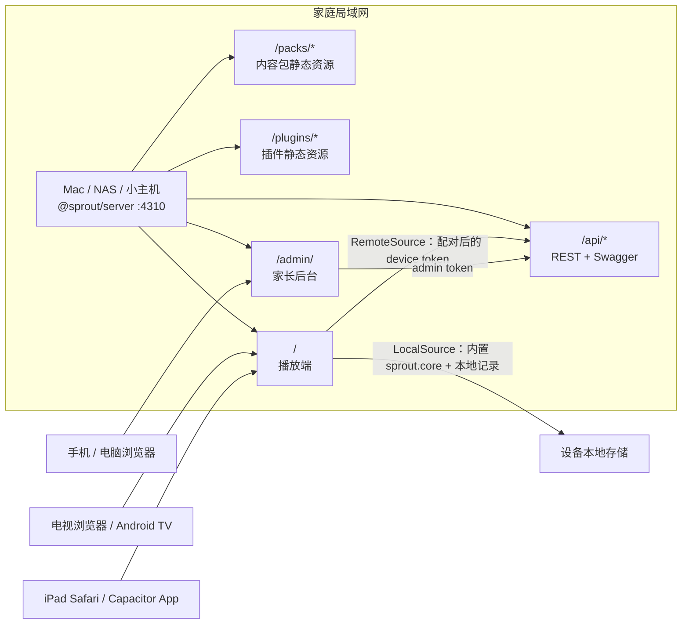

# 芽芽成长 Sprout

芽芽成长是面向 6 个月–3 岁家庭的亲子共学工具：屏幕只做一个慢慢的引子，真正的学习发生在家长的回应、真实物品、游戏、阅读、歌唱和户外活动里。它不是电子保姆，也不以延长观看时长为目标。

项目适合在家庭局域网运行：一台 Mac、NAS 或小主机运行服务端，电视、iPad 或浏览器打开播放端，手机和电脑打开家长后台。没有服务器时，也可以使用播放端内置内容包离线体验。

## 先了解五件事

1. **真人互动优先于被动观看。** 婴幼儿把视频内容迁移到现实世界并不容易；屏幕内容必须配合家长共看、提问、等待和回应。[视频学习元分析](https://onlinelibrary.wiley.com/doi/abs/10.1111/cdev.13429) 与本项目的[循证综述](docs/research/evidence-review.md#31-视频缺陷--迁移缺陷强)是产品取舍的主要依据。
2. **6–17 月龄不给宝宝播放孩子侧课程。** 这一阶段使用家长指引课、打印实体卡和真实物品；家长读完就放下设备陪玩。18–23 月龄共看默认关闭，24–36 月龄也可以完全不看，若开启必须由家长陪同。[屏幕策略](docs/research/evidence-review.md#91-总体定位)说明了中国指南、WHO 与 AAP 口径的差异。
3. **亲子对话比“听得更多”更重要。** 看见孩子正在关注的东西，命名，停一下，接住目光、动作、手势或声音，再把话题放回生活。[语言证据](docs/research/evidence-review.md#4-语言中文母语--英语启蒙)与 [JAMA Pediatrics 屏幕使用综述](https://jamanetwork.com/journals/jamapediatrics/fullarticle/2762864)支持把回合对话放在中心。
4. **中文自然交流是主干，英语是可选的互动补充。** 双语不会因为同时存在就造成语言迟缓，但每种语言都需要真实、足量且自然的输入；不熟练的英语或录播音频不能替代高质量中文交流。[双语与语言章节](docs/research/evidence-review.md#42-儿向语言parentese强)给出边界。
5. **数学从生活里的数量、空间和规律开始。** 点一件、说一个，数完说总数；比较两组真实物品；在收拾、穿衣、拼图和摆放中说“里面、上面、旁边、再来一个”。不使用快速闪卡，也不把课程正确率当作能力诊断。[数学启蒙章节](docs/research/evidence-review.md#5-数学启蒙)列出了按月龄的活动建议。

这些原则不是医疗建议，也不承诺某节课会带来特定发育或学习结果。屏幕时间、睡眠、进食、身体活动和发育担忧请结合孩子实际情况，必要时咨询儿科或儿保专业人员。

## 功能一览

| 部分 | 能做什么 |
| --- | --- |
| 播放端 | 电视/iPad/浏览器播放课程；支持遥控器 D-pad、键盘和触屏；支持远程服务器与离线内置内容；按月龄提供家长模式、亲子共看、暂停、家长门和自然结束点。 |
| 家长后台 | 首次设置、孩子档案、语言模式、屏幕时段、今日计划、成长路线、课程库、打印实体卡、里程碑观察、设备配对、备份恢复。 |
| 内容包 | `sprout.core` 内置 6 个阶段、96 节课程和 220 个词条；课程含家长导语、慢节奏步骤和线下延伸活动；内容可打包、校验、导入和升级。 |
| 活动插件 | 17 个内置活动，另支持带命名空间的第三方活动插件；插件必须遵守生命周期、焦点导航、资源、音频、权限和婴幼儿内容安全约定。 |

## 架构



服务端使用 Node 22、Fastify 和 `node:sqlite`，默认监听 `0.0.0.0:4310`。播放端通过同一个 `DataSource` 抽象连接服务器或使用本地数据；后台和播放端都复用 `@sprout/schema` 的数据契约，排课与屏幕策略复用 `@sprout/core`。

完整边界、数据流和目录所有权见[系统架构](docs/dev/architecture.md)。

## 仓库结构

```text
apps/
  server/                 Fastify 服务端、SQLite、静态文件托管
  admin/                  家长后台（Vite + React + Ant Design）
  player/                 大屏播放端与 Capacitor 工程
packages/
  schema/                 数据契约、Zod 校验、JSON Schema
  core/                   排课、屏幕时间、内容包运行时工具
  plugin-sdk/             活动插件运行时契约与视觉令牌
  activities/             17 个内置活动与 playground
content/
  packs/sprout-core/      内置词库、路线、课程、素材和音频
  milestones/             CDC 2022 里程碑整理数据
scripts/                  内容素材、音频、校验、bundle 和 zip 流水线
plugins/examples/         第三方插件示例
docs/                     研究、课程、开发、部署和家长指南
deploy/                   Docker、macOS 自启和发布检查
```

## 快速开始

### 环境

- Node.js `>=22.12`，当前项目验证版本为 Node 22。
- pnpm `11.1.0`（根 `package.json` 的 `packageManager`）。
- macOS 上生成系统 TTS 音频需要可用的 `say`；没有音频时播放端会按“预生成音频 → Web Speech API → 文字”回退。

依赖已经随开发工作区准备好时，可以跳过安装步骤。全新工作区可运行：

```sh
corepack enable
export pnpm_config_verify_deps_before_run=false
pnpm install
```

### 生成内容与构建

内容源文件已经在仓库中；需要从源重新生成路线、素材、音频、校验结果和离线 bundle 时，在 macOS 上运行：

```sh
export pnpm_config_verify_deps_before_run=false
pnpm content:all --pack content/packs/sprout-core
```

`content:all` 依次执行 `route → assets → audio → validate → bundle`。它会改写生成的路线、音频和 `bundle.json`，不应在只想查看源码时随意运行。构建三个工作区应用：

```sh
export pnpm_config_verify_deps_before_run=false
pnpm build
```

### 启动已构建版本

```sh
export pnpm_config_verify_deps_before_run=false
pnpm start
```

然后打开：

- [家长后台](http://localhost:4310/admin/)
- [播放端](http://localhost:4310/)
- [API 文档](http://localhost:4310/api/docs/)

首次进入后台时设置家庭名、管理员密码、孩子名字、生日和语言模式。之后在播放端选择“连接家庭服务器”，在后台“播放设备”页输入播放端显示的 6 位配对码，并绑定孩子。配对码 10 分钟有效。

### 开发模式

服务端、后台和播放端分别运行；每个终端都先设置 pnpm 依赖检查环境变量：

```sh
# 终端一：服务端
export pnpm_config_verify_deps_before_run=false
pnpm --filter @sprout/server dev
```

```sh
# 终端二：播放端，http://localhost:5310/
export pnpm_config_verify_deps_before_run=false
pnpm --filter @sprout/player dev
```

```sh
# 终端三：后台，http://localhost:5311/admin/
export pnpm_config_verify_deps_before_run=false
pnpm --filter @sprout/admin dev
```

开发端口被占用时，按各包脚本支持的备用端口运行；结束验证后关闭由自己启动的服务。

## 电视与 iPad

电视浏览器或 Android TV 可以直接打开服务端根地址；Android TV 也可以安装 release APK。iPad 可以用 Safari 打开根地址并添加到主屏幕，或使用 Capacitor App。设备与服务器必须在同一家庭网络，电视端不能填写服务器的 `localhost`。

详细的 Mac、Docker、Android TV、iPad、配对、备份和常见问题步骤见[部署与设备安装](docs/deploy/README.md)。发布验证记录见[部署验证记录](docs/deploy/validation.md)。

## 扩展

- **制作内容包：** 从[内容包制作指南](docs/dev/content-pack-guide.md)和 `content/examples/hello-pack/` 开始，使用 schema 校验、资源署名、音频清单和 bundle 流程。
- **编写第三方插件：** 阅读[插件开发指南](docs/dev/plugin-guide.md)，插件 type 必须带点号命名空间，并遵守 `@sprout/plugin-sdk` 契约。
- **查看课程路线：** 见[96 节课程总览](docs/guide/content-roadmap.md)；路线源文件位于 `content/packs/sprout-core/routes/_stages/`。
- **家长使用：** 见[家长使用手册](docs/guide/parent-manual.md)，内容按 6–17、18–23、24–29、30–36 月龄说明。

## 开发、测试与契约

根脚本与工作区脚本保持一致：

```sh
export pnpm_config_verify_deps_before_run=false
pnpm test
pnpm typecheck
pnpm content:typecheck
pnpm content:test
pnpm qa:verify
```

常用包级命令：

```sh
export pnpm_config_verify_deps_before_run=false
pnpm --filter @sprout/server typecheck
pnpm --filter @sprout/server test
pnpm --filter @sprout/server build
pnpm --filter @sprout/admin typecheck
pnpm --filter @sprout/admin test
pnpm --filter @sprout/admin build
pnpm --filter @sprout/player typecheck
pnpm --filter @sprout/player test
pnpm --filter @sprout/player build
```

开发任务和协作边界见 [`docs/dev/tasks/`](docs/dev/tasks/)；最重要的契约入口是：

- [`packages/schema/src/*.ts`](packages/schema/src/)：内容、路线、运行时和插件清单的数据事实来源。
- [`packages/plugin-sdk/src/types.ts`](packages/plugin-sdk/src/types.ts)：活动插件生命周期与 `ActivityContext`。
- [`packages/plugin-sdk/src/tokens.css`](packages/plugin-sdk/src/tokens.css)：播放端与活动共用的视觉令牌。
- [`docs/dev/api.md`](docs/dev/api.md)：REST API。
- [`docs/dev/architecture.md`](docs/dev/architecture.md)：架构和所有权。
- [`docs/README.md`](docs/README.md)：完整文档索引。

## 许可与素材署名

本仓库的内容、代码和第三方素材按各自目录的声明使用，不能把整个仓库笼统地标成同一种许可证。内置核心包的主要素材包括：

- Fluent Emoji：Microsoft，MIT；适用范围和完整许可见 [`content/packs/sprout-core/LICENSES.md`](content/packs/sprout-core/LICENSES.md)。
- 芽芽成长自绘图形：CC0-1.0；对应来源见 `content/packs/sprout-core/assets/sources.json`。
- 内置内容包、旋律、歌词和音频：以课程与内容包中的真实署名为准；传统旋律、公有领域和原创歌词不能互相替代。
- macOS 系统合成音频（Tingting、Samantha 等）：**仅限个人非商业使用，不可公开再分发**，不属于课程或图片的 CC0/MIT 授权。公开仓库、下载 ZIP、CDN、应用安装包及商业产品不得附带这些录音，免费或非营利发布也不例外；须改用明确允许相应用途与再分发的可商用 TTS 或获授权真人录音，重新生成整个目标包的 `audio/`、bundle 与 ZIP。
- 播放端界面图标使用 Lucide，播放端关于页和对应包信息会显示署名。

新增图片、录音、视频、旋律或插件时，请同时更新内容包的 `credits`、`LICENSES.md` 或插件清单，不要把 `custom` 当作自动获得许可。

音频条款依据 Apple macOS Tahoe 26 许可第 2.F 节（2026-10-03 核对，以实际安装版本为准）。服务端可通过现有 `TtsProvider` 接口接入获授权声音，`audio/manifest.json` 的结构与文本 key 不变；详细接入、全量重配音及发布检查见[内容流水线](docs/dev/content-pipeline.md#音频授权与公开发布)。后台切换设置不会自动替换内置或扩展包音频。

## 免责声明

芽芽成长是亲子共学和家庭活动安排工具，不是医疗设备、治疗工具或发育诊断工具。里程碑条目用于日常观察和与专业人员沟通，不用于给孩子打分、排名或下诊断；发现能力倒退或持续担忧时，请及时咨询儿科或儿保医生。

屏幕策略是结合研究和产品边界做出的家庭使用建议，不是对所有家庭都适用的医疗处方。家长始终可以关闭孩子侧屏幕内容，改用家长指引、打印卡、纸书、真实物品、歌唱和户外活动。
